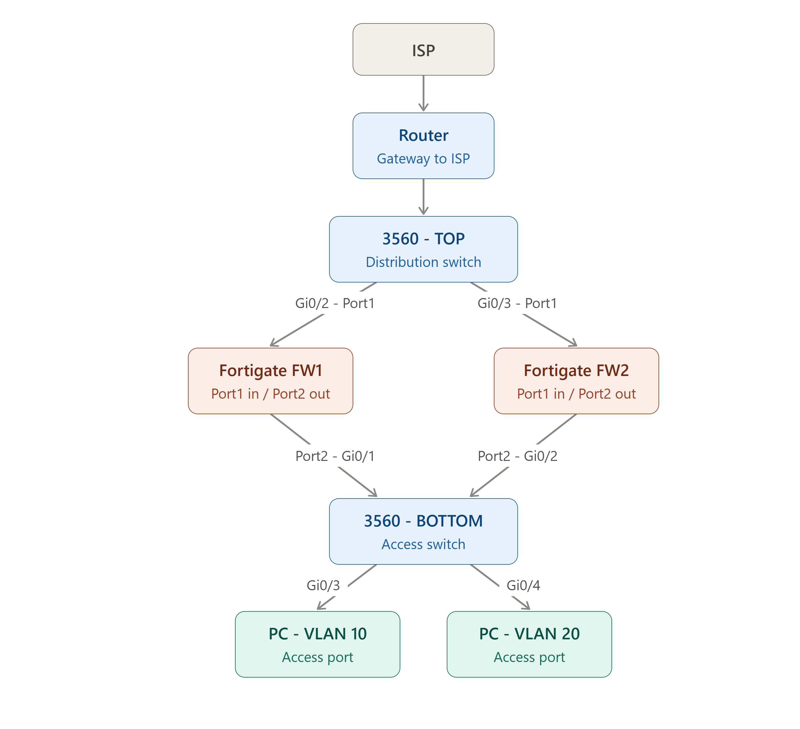
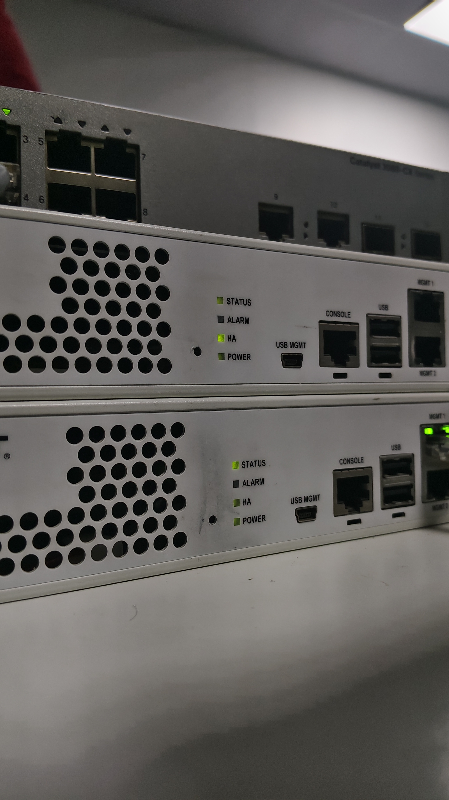
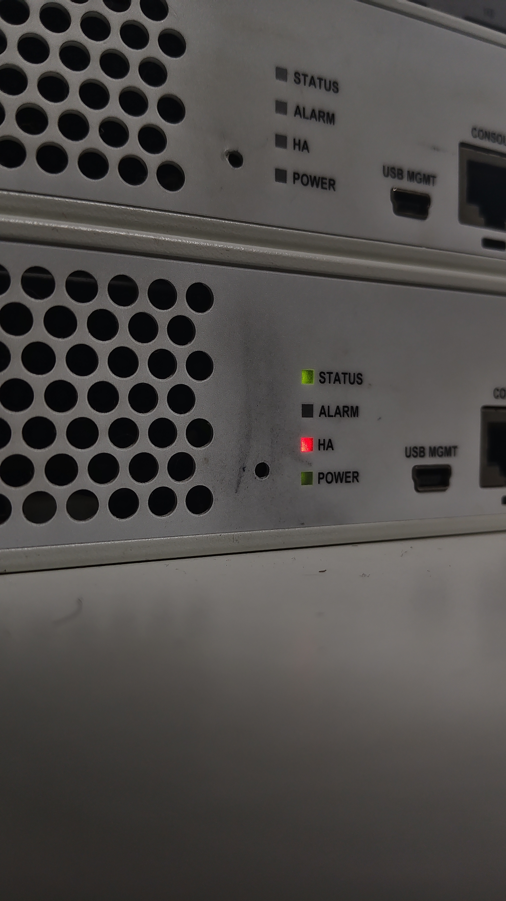
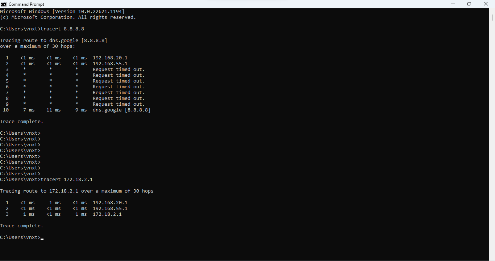

# FortiGate Redundant Firewall Lab (Active-Passive HA Failover)

A hands-on home lab demonstrating a **High Availability (HA) Active-Passive cluster** built with two FortiGate firewalls, Cisco 3560 switches, and VLAN segmentation — with a live failover test to prove redundancy actually works.

---

## 📌 Project Objective

Design and deploy a redundant firewall edge using two FortiGate appliances in an **Active-Passive HA cluster**, segment internal traffic into VLANs, configure routing/NAT/DNS for internet access, and **prove failover** by powering off the primary unit while traffic is live.

---

## 🖧 Network Topology

| Layer | Device | Role |
|---|---|---|
| Edge | Router | Gateway to ISP |
| Distribution | Cisco 3560 - TOP | Uplinks router to both firewalls |
| Security | FortiGate FW1 & FW2 | Active-Passive HA Cluster (Port1 = WAN in, Port2 = LAN out) |
| Access | Cisco 3560 - BOTTOM | Connects VLAN 10 and VLAN 20 end devices |
| Endpoints | PC - VLAN 10 / PC - VLAN 20 | Test clients |

**Traffic flow:** ISP → Router → 3560-TOP → FortiGate HA Pair → 3560-BOTTOM → VLAN 10 / VLAN 20 PCs

---

## ⚙️ Configuration Steps

### 1. Base Interface Setup
Configured `port1` as the WAN-facing interface on the primary unit (FW1-HA) with a static IP for the upstream link to the distribution switch.

### 2. VLAN Interface Configuration
Created two VLAN sub-interfaces on `port2` (LAN side) — one per department/segment — each with its own subnet and DHCP scope.

**VLAN 10** — `192.168.10.1/24`, DHCP range `192.168.10.20–192.168.10.200`

**VLAN 20** — `192.168.20.1/24`, DHCP range `192.168.20.20–192.168.20.200`

Final interface table showing both VLANs active on port2:

### 3. DNS Configuration
Set the FortiGate to use public DNS resolvers (`8.8.8.8` primary, `1.1.1.1` secondary) instead of FortiGuard defaults, for predictable name resolution during testing.

### 4. Firewall Policies (VLAN → WAN)
Created two NAT-enabled ACCEPT policies allowing each VLAN to reach the internet through `port1`.

- **VLAN10-to-WAN** (Policy ID 2)
- **VLAN20-to-WAN** (Policy ID 3)

### 5. HA Cluster Configuration
Configured both FortiGate units under **System > HA** with matching cluster settings:

| Setting | FW1 (Primary) | FW2 (Secondary) |
|---|---|---|
| Mode | Active-Passive | Active-Passive |
| Group name | FW-HA-CLUSTER | FW-HA-CLUSTER |
| Device priority | 200 | 100 |
| Monitor interfaces | port1, port2 | port1, port2 |
| Heartbeat interface | port8 | port8 |

Higher priority (200) makes FW1 the Primary unit; FW2 (100) becomes Secondary and takes over automatically if FW1 fails.

### 6. Verifying HA Synchronization
Confirmed both units synced successfully under **System > HA Monitor** — FW1-HA as Primary, FW2-HA as Secondary, both showing "Synchronized" status.

Also verified the hostname and system clock on the primary unit:

### 7. Physical HA Status Check
Confirmed HA status LEDs on the physical FortiGate units — a solid HA LED indicates cluster heartbeat is active and synced.

---

## 🔬 Failover Testing

To validate that HA actually works (not just configured), a continuous ping was run against the VLAN gateway and the internet while the **primary unit (FW1) was physically powered off**, then powered back on.

### Step 1 – Baseline ping before failover
Continuous ping to gateway `192.168.20.1` running clean with sub-millisecond replies.

### Step 2 – FW1 powered off → failover in progress
A short burst of `Request timed out` (heartbeat/session takeover gap) followed by ping automatically resuming once FW2 took over as Primary — proving near-instant failover.

### Step 3 – Internet reachability during failover
Ping to `8.8.8.8` shows a brief `Destination host unreachable` window (gateway re-election) before traffic resumes normally through the surviving unit.

### Step 4 – DHCP + routing sanity check
Confirmed the VLAN 20 client still holds a valid DHCP lease (`192.168.20.100`) and default gateway through the whole event.

### Step 5 – Traceroute verification
Traced the path from a VLAN 20 client to `8.8.8.8` and to an internal test host (`172.18.2.1`), confirming correct routing through the HA gateway after recovery.

---

## ✅ Results

- Successfully built and synced a 2-node FortiGate **Active-Passive HA cluster**.
- Segmented traffic into **VLAN 10** and **VLAN 20** with independent DHCP scopes.
- Configured NAT firewall policies for secure internet egress per VLAN.
- **Proved failover** works end-to-end: powering off the primary unit caused only a brief, automatic interruption before the secondary unit took over — with no manual reconfiguration.
- Verified recovery: powering the primary back on restored the original HA state cleanly.

---

## 🛠️ Skills Demonstrated

`FortiGate` `FortiOS` `High Availability (Active-Passive)` `VLAN Segmentation` `DHCP` `NAT & Firewall Policy` `DNS Configuration` `Cisco Catalyst Switching` `Network Troubleshooting` `ping / tracert / ipconfig` `Failover Testing`
